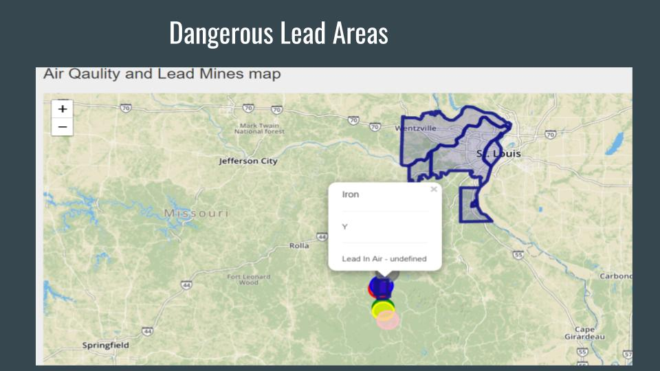

### Lead Poisoning in Missouri kids Analysis.###

**Purpose**: 

The purpose of this project was to Analyze Blood Lead Levels in kids of 6 years and younger from different Missouri counties.  And also compare Missouri State BLL(Blood Lead Levels)  with other top 10 States.

**Data Source:** We collected Missouri Lead level Data  in the CSV format  from https://www.cdc.gov/nceh/lead/data/surveillance-data.html

and The Missouri county boundaries from https://data-msdis.opendata.arcgis.com/datasets/mo-2018-county-boundaries?geometry=-114.488%2C32.027%2C-30.86%2C44.088&orderBy=DB2GSE_ST_

**Technologies Used**
Front End: JavaScript, HTML, CSS, Bootstrap, JavaScript Libraries: D3.js, GeoJson,  Leaflet , Plotely

Middle Layer: Python, Flask

Back End: MongoDB 

**Process**

-**Data Collection**: Collected following data from different sources: 

1.Missouri Mine Location Data,   2.Missouri BLL Concentrations 3.Missouri Counties lat and long 

4.BLL Concentrations per state. 

-**Data Cleansing:** 

Imported CSV's into Jupiter notebook and performed Data Cleansing by 

-removing unwanted characters such as (,),

-splitting the words to get exact county names, 

-filling NA values and

-changing column names. 

exported the clean CSV  and imported it in to MongoDB. 

**Web-Application:** Built web Application using HTML-5, CSS , Bootstrap, Python, JavaScript and flask, MongoDB. 

-Wrote complex PyMongo queries to pull Top Ten BLL states besides Missouri. 

   

```PyMongo
 missouri_lead_level_data = getMongoData({"state":"Missouri","year":year})

​    top_ten_lead_level_resp=mongo.db.AllStates.find({'state':{'$ne':"Missouri"},'year':year},\
      {'_id':False}).sort([("prct_chldrn_confirbill_5ugdl",-1)]).limit(10)
```

-defined API routes and wrote PyMongo query to pull BLL by each year in Missouri. 

```PyMongo
@app.route("/years/<year>")
def getLeadLevelsForYear(year):
	query = { "year" : year }
     bllByStateData = mongo.db.AllStates.find(query, {'_id': False})
     data = []
	 for doc in bllByStateData:
          data.append(doc)
     return jsonify(data)
```


**Objectives and Findings** 

1. Find counties with high risk of Blood Lead Levels (BLL) in kids under 6 years5 micrograms minimum risk level for poisoning


2. Compare Missouri BLL to top 10 BLL states in US (2012-2017)

   


3.Whether kids staying near lead mine areas have higher chance of receiving high BLL




Overall Results: 

1. St. Louis city, St louis County , Jackson and Buchanan Counties - High Count BLL
2. In overall last 7 years Pennsylvania, New York and Ohio states show high number of kids affected by lead as compared to Missouri.
3. Although more data is needed to truly say risky/dangerous blood lead levels found in children are related to counties where lead mines and poor lead air quality are present. It is highly suspicious that concentrations of lead and children with unhealthy blood lead level counts are present in the same regions. 
